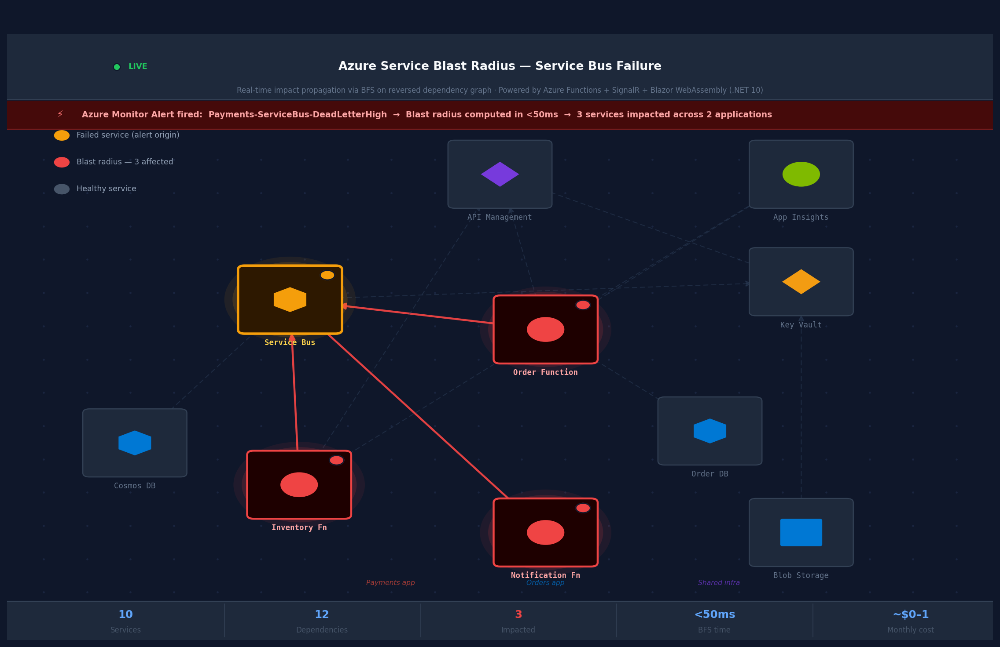

# Azure Service Blast Radius Tool — Architecture Design

**Version:** 1.0  
**Team:** IT / Business Operations  
**Platform:** Microsoft Azure  
**Prepared by:** Shaun Nguyen  
**Last Updated:** June 2026  

### Changelog

| Version | Change |
|---|---|
| 1.0 | Initial design — Azure Monitor alerts, serverless blast radius engine, Azure SignalR real-time push, Blazor WebAssembly (.NET 10 LTS) 3D dashboard |

---

## Table of Contents

1. [Problem Statement](#problem-statement)
2. [Proposed Solution](#proposed-solution)
3. [Architecture Overview](#architecture-overview)
4. [Component Breakdown](#component-breakdown)
5. [How It Works — Alert to Graph in 5 Steps](#how-it-works--alert-to-graph-in-5-steps)
6. [Data Model](#data-model)
7. [Blast Radius Algorithm](#blast-radius-algorithm)
8. [Authentication & Security](#authentication--security)
9. [Technology Decisions](#technology-decisions)
10. [Cost Estimate](#cost-estimate)
11. [Scope Boundary](#scope-boundary)
12. [Getting Started - Local Development](#getting-started--local-development)
13. [Roadmap](#roadmap)

---

## Problem Statement

Our team manages multiple microservice applications on Azure where many services are mutually shared across applications. When a service fails today, the team has no automated way to answer two critical questions:

- **Which services are affected right now?**
- **Which teams need to be alerted?**

The current process is manual — someone has to mentally trace dependencies across applications to assess impact. This is slow, error-prone, and gets harder as the number of services grows.

---

## Proposed Solution

The **Azure Service Blast Radius Tool** is an internal web application that:

- **Automatically detects** Azure service failures via existing Azure Monitor alerts — no new monitoring setup required
- **Instantly computes** which services are affected by traversing a pre-built dependency graph
- **Broadcasts the result in real time** to all team members with the dashboard open — no page refresh needed
- **Visualises the impact** as a live 3D graph with affected services highlighted, using official Azure service icons

**Example — blast radius after a Service Bus failure:**

> The graph below shows a representative service dependency map. The amber node is the failed service; red nodes and edges are its blast radius — services that depend on it directly or transitively. Click any node to simulate an alert firing on that service.

  

The entire solution runs on Microsoft and Azure native services, is serverless, and costs approximately **$0–1/month** to operate.

---

## Architecture Overview

```
┌─────────────────────────────────────────────────────────────────────┐
│                        Azure Monitor                                │
│        Alert Rules — one per managed Azure resource                 │
└───────────────────────────┬─────────────────────────────────────────┘
                            │ alert fires
                            ▼
┌─────────────────────────────────────────────────────────────────────┐
│                  Action Group (Webhook)                             │
│        Routes every alert to the blast radius function              │
└───────────────────────────┬─────────────────────────────────────────┘
                            │ HTTP POST
                            ▼
┌─────────────────────────────────────────────────────────────────────┐
│               Azure Functions  (Python — Serverless)                │
│                                                                     │
│  Receives alert → identifies failed service → traverses graph       │
│  → persists result → broadcasts to all connected clients            │
└──────────┬──────────────────┬──────────────────┬───────────────────┘
           │                  │                  │
           ▼                  ▼                  ▼
┌────────────────┐  ┌──────────────────┐  ┌─────────────────────────┐
│ Azure Blob     │  │ Azure SignalR    │  │ Azure Static Web Apps   │
│ Storage        │  │ Service          │  │                         │
│                │  │                  │  │ Blazor WebAssembly      │
│ Service graph  │  │ Real-time push   │  │ (.NET 10 LTS / C# 14)  │
│ + latest       │  │ to all connected │  │                         │
│ blast result   │  │ browser clients  │  │ 3D graph + Azure icons  │
└────────────────┘  └────────┬─────────┘  │ Fluent UI components   │
                             │ WebSocket  └──────────┬──────────────┘
                             └──────── instant push ─┘
```

---

## Component Breakdown

### 1. Azure Monitor — Alert Detection

Azure Monitor is the entry point for failure detection. Alert rules are already configured across the team's applications — this solution plugs into the existing alerting infrastructure without requiring new monitoring configuration.

**Four alert types are supported out of the box:**

| Alert Type | Detects | Example |
|---|---|---|
| Metric Alert | Performance degradation | Service Bus dead-letter queue depth exceeded |
| Log Alert (KQL) | Application-level errors | Exception rate spike in Application Insights |
| Resource Health Alert | Azure platform downtime | Function App becomes unavailable |
| Activity Log Alert | Control plane changes | Resource deleted or stopped |

All alert rules feed into a single Action Group, ensuring every failure — regardless of type — automatically triggers the blast radius computation.

---

### 2. Action Group — Alert Routing

A single Azure Monitor **Action Group** is configured with a webhook that calls the Azure Function the moment an alert fires. The **common alert schema** is enabled, which normalises the payload structure across all four alert types into one consistent format. This means the function reliably identifies the failed Azure resource regardless of which alert type triggered it — no per-type handling required.

---

### 3. Azure Functions — Blast Radius Engine

The core logic runs as a **serverless Python Azure Function** on the Consumption plan. It executes only when an alert fires or the UI requests data — there is no always-on compute cost.

**Four API endpoints are exposed:**

| Endpoint | Purpose |
|---|---|
| `POST /api/blast-radius` | Receives alert, computes blast radius, persists result, broadcasts to clients |
| `GET /api/graph` | Returns the full service dependency graph for initial UI load |
| `GET /api/blast-result` | Returns the latest blast radius result for clients joining mid-incident |
| `GET /api/signalr/negotiate` | Issues a SignalR connection token to authenticated Blazor clients |

**Why Azure Functions over a dedicated API server:** A dedicated server (e.g. Container App) incurs always-on cost even when idle. At a team of 10 with infrequent alert events, the Consumption plan's first 1 million executions per month are free. The graph loads in under 100ms at hundreds of nodes — well within Function response tolerances.

---

### 4. Azure Blob Storage — Graph Persistence

All graph state is persisted as JSON files in a single Azure Blob Storage container named `graph-data`.

| File | Contents |
|---|---|
| `services.json` | Full service dependency graph — all nodes, edges, and service metadata |
| `blast-result.json` | Latest blast radius result — served to clients joining after an alert fires |

The graph is loaded into memory on each Function invocation. At hundreds of nodes this takes under 100ms. Access is secured via Managed Identity — no connection strings are stored in code or source control.

**Why Blob Storage over a graph database:** A managed graph database (e.g. Cosmos DB Gremlin) adds ~$25+/month of baseline cost for a graph that fits comfortably in a single JSON file. Blob Storage costs under $0.01/month at this scale.

---

### 5. Azure SignalR Service — Real-Time Push

Azure SignalR Service maintains persistent WebSocket connections to all connected Blazor clients and delivers blast radius results the instant an alert fires — no polling, no page refresh required.

**Key configuration decisions:**

| Decision | Value | Rationale |
|---|---|---|
| Tier | Free | 20 concurrent connections, 20K messages/day — sufficient for a team of 10 |
| Service mode | Serverless | Required for Azure Functions integration — no hub server to manage |
| Fallback transport | SSE / long-polling | Automatic fallback if WebSocket is unavailable in a network environment |

When the Blazor page loads, it negotiates a short-lived access token from the Function and opens a persistent WebSocket connection. The .NET 10 built-in `ReconnectModal` handles connection loss automatically — clients reconnect and re-register without any custom code.

---

### 6. Blazor WebAssembly — Dashboard UI

The frontend is a **Blazor WebAssembly** application written entirely in C# and hosted on Azure Static Web Apps. It is secured via Microsoft Entra ID — only users in the team's existing Microsoft tenant can access it, with no extra identity infrastructure required.

**UI behaviour:**

- On page load — fetches the full dependency graph and latest blast result; renders the 3D interactive graph
- When an alert fires — SignalR pushes the result instantly; affected nodes turn red across all open browsers simultaneously
- On node click — opens a Fluent UI side panel showing service name, Azure type, owning application, criticality, and current health status

**Node visual legend:**

| Appearance | Meaning |
|---|---|
| Blue Azure icon, no ring | Healthy service |
| Red Azure icon, red ring | In blast radius — downstream dependency affected |
| Amber Azure icon, amber ring | Directly failed service — alert origin |
| Red edge, thicker | Dependency path within blast radius |
| Grey edge | Healthy dependency path |

**Key technology decisions:**

| Decision | Rationale |
|---|---|
| Blazor WebAssembly (.NET 10 LTS) | C# throughout — no JavaScript framework; LTS support to November 2028 |
| Microsoft Fluent UI Blazor | Microsoft's official component library — consistent Azure Portal look and feel |
| 3d-force-graph via JS Interop | No Microsoft-native 3D graph library exists — only non-Microsoft exception in the stack |
| Azure Architecture Icons | Official Microsoft icon set — each node renders the actual Azure service icon |
| Azure Static Web Apps | Native Blazor WASM hosting; Entra ID auth built-in at no extra cost |
| .NET 10 ReconnectModal | Built-in SignalR reconnection UI — zero custom reconnect code needed |
| .NET 10 JS fingerprinting | Automatic cache-busting on every deploy — browsers always load the latest graph.js |

---

## How It Works — Alert to Graph in 5 Steps

```
Step 1 — DETECT
  Azure Monitor fires an alert rule when a service breaches
  a metric threshold, log condition, or health check.

Step 2 — ROUTE
  The Action Group webhook delivers the alert payload
  to the Azure Function within seconds.

Step 3 — COMPUTE
  The Function identifies the failed service, loads the
  dependency graph, and runs BFS traversal to find every
  service that depends on the failed one.

Step 4 — BROADCAST
  The result is written to Blob Storage (for late joiners)
  and simultaneously pushed via SignalR to every connected
  browser client.

Step 5 — VISUALISE
  The Blazor dashboard instantly re-colours affected nodes
  red. Every team member sees the blast radius in real time
  without refreshing their browser.
```

---

## Data Model

### Service Node

Each node represents one Azure resource. Node IDs match Azure resource names exactly — this enables automatic resolution from alert payloads with no manual mapping required.

| Field | Description | Example |
|---|---|---|
| `id` | Azure resource name — must match exactly | `payments-servicebus` |
| `azureType` | Icon key — maps to the correct Azure icon sprite | `service-bus` |
| `app` | Owning application | `Payments` |
| `criticality` | Service importance tier | `critical` / `high` / `medium` / `low` |

### Dependency Edge

Edges are directed: `source` **depends on** `target`. The direction enables blast radius traversal — reversing the graph finds every service that depends on the failed one.

| Field | Description |
|---|---|
| `source` | The consuming service |
| `target` | The dependency being consumed |

---

## Blast Radius Algorithm

The blast radius is computed using **Breadth-First Search (BFS) on the reversed dependency graph** — a standard, well-understood graph algorithm.

**Why reverse the graph:** Edges are stored as `consumer → dependency`. To find what is affected when a service fails, the graph is reversed so edges point `dependency → consumer`. BFS from the failed node then discovers every direct and transitive downstream consumer automatically.

**Performance characteristics:**

| Metric | Value |
|---|---|
| Time complexity | O(V + E) — linear in nodes and edges |
| Typical execution time | Under 50ms at hundreds of nodes |
| Library | NetworkX (Python) — purpose-built graph library; no Azure-native equivalent |

---

## Authentication & Security

All authentication and access control uses existing Microsoft infrastructure — no new identity systems are introduced.

| Concern | Solution |
|---|---|
| UI access control | Microsoft Entra ID via Azure Static Web Apps built-in auth — restricted to tenant users |
| Function → Blob Storage | Managed Identity with `Storage Blob Data Contributor` role — no credentials in code |
| Action Group → Function | Azure Function host key scoped to the webhook endpoint |
| Secrets management | Azure Key Vault referenced via Function app settings — no secrets in source control |

---

## Technology Decisions

The stack is intentionally Microsoft and Azure native throughout. One justified exception is noted.

| Layer | Technology | Decision Rationale |
|---|---|---|
| Alert detection | Azure Monitor | Existing infrastructure — no new tooling required |
| Alert routing | Action Groups | Native webhook support; zero cost |
| Serverless API | Azure Functions (Python) | No always-on cost; Python required for NetworkX graph library |
| Graph computation | NetworkX (Python) | No Azure-native graph traversal library; handles hundreds of nodes in milliseconds |
| Graph & state storage | Azure Blob Storage | Lowest cost option; graph fits in a single JSON file |
| Real-time push | Azure SignalR Service | Microsoft-native WebSocket push; free tier sufficient for team of 10 |
| Frontend | Blazor WebAssembly (.NET 10 LTS) | C# throughout; no JavaScript framework; supported to November 2028 |
| SignalR client | Microsoft.AspNetCore.SignalR.Client | First-class .NET 10 integration; built-in reconnect and ReconnectModal |
| UI components | Microsoft Fluent UI Blazor | Microsoft's official Blazor design system |
| 3D graph rendering | 3d-force-graph + Three.js ⚠️ | **Only non-Microsoft exception** — no Microsoft-native 3D graph library exists |
| Node icons | Azure Architecture Icons | Official Microsoft icon set; free for internal tooling |
| Hosting | Azure Static Web Apps | Native Blazor WASM support; Entra ID auth built-in |
| Authentication | Microsoft Entra ID | Existing tenant; zero additional cost |

---

## Cost Estimate

All estimates are based on a team of 10 with low-to-moderate alert volume. Every component operates within its free tier at this scale.

| Azure Service | Tier | Estimated Monthly Cost |
|---|---|---|
| Azure Functions | Consumption — first 1M executions free | ~$0 |
| Azure Blob Storage | LRS, minimal storage | ~$0.01 |
| Azure SignalR Service | Free — 20 connections, 20K messages/day | $0 |
| Azure Static Web Apps | Free tier | $0 |
| Azure Monitor Action Groups | First 1,000 webhook notifications free | $0 |
| Microsoft Entra ID | Existing M365 tenant | $0 |
| **Total** | | **~$0–1 / month** |

---

## Scope Boundary

This solution is built and owned by the **software development team**. The following are handled by the dedicated DevOps team and are outside this design scope:

| Out of Scope | Owner |
|---|---|
| Azure resource provisioning | DevOps team — manual via Azure Portal for dev; IaC for higher environments |
| CI/CD pipeline definition and maintenance | DevOps team |
| Deployment to staging and production | DevOps team |

For local development, the team runs the Azure Function and Blazor app locally using Azure Functions Core Tools and `dotnet run`, pointed at manually provisioned Azure dev resources.

---

## Getting Started — Local Development

### Prerequisites

Ensure you have the following installed:

- **Python 3.9+** — for the Azure Functions backend
- **.NET 10 SDK** — for the Blazor frontend and tests
- **Azure Functions Core Tools** — required to run Azure Functions locally (`npm install -g azure-functions-core-tools@4 --unsafe-perm`)
- **Git** — for version control

### Project Structure

```
BlastRadiusTool/
├── BlastRadiusApi/              # Python Azure Functions backend
│   ├── function_app.py          # HTTP endpoints (blast_radius, graph, blast_result, signalr/negotiate)
│   ├── graph_utils.py           # BFS graph traversal and serialisation
│   ├── signalr_utils.py         # SignalR broadcast helpers
│   ├── scripts/
│   │   └── seed_graph.py        # One-time graph seeding to Blob Storage
│   ├── requirements.txt         # Python dependencies (networkx, azure-functions, etc.)
│   ├── local.settings.json.example
│   └── tests/                   # pytest unit and integration tests
├── BlastRadiusUI/               # Blazor WebAssembly frontend (.NET 10 LTS / C# 14)
│   ├── Pages/Home.razor         # 3D graph dashboard
│   ├── Components/              # Reusable Blazor components
│   └── wwwroot/                 # Static assets (CSS, JavaScript interop)
├── BlastRadiusUI.Tests/         # xUnit v3 tests for Blazor models
├── BlastRadiusTool.slnx         # .NET solution file
└── README.md                    # This file
```

### Step 1: Clone and Setup

```powershell
git clone https://github.com/YOUR_ORG/BlastRadiusTool.git
cd BlastRadiusTool
```

### Step 2: Set Up the Azure Functions Backend

#### 2a. Install Python dependencies

```powershell
cd BlastRadiusApi
pip install -r requirements.txt
```

#### 2b. Configure local settings

Copy `local.settings.json.example` to `local.settings.json`:

```powershell
cp local.settings.json.example local.settings.json
```

Edit `local.settings.json` with your local Azure dev environment credentials:

```json
{
  "IsEncrypted": false,
  "Values": {
    "AzureWebJobsStorage": "UseDevelopmentStorage=true",
    "AzureSignalRConnectionString": "<your-signalr-connection-string>",
    "AZURE_STORAGE_ACCOUNT_NAME": "<your-storage-account-name>",
    "AZURE_STORAGE_ACCOUNT_KEY": "<your-storage-account-key>",
    "FUNCTIONS_WORKER_RUNTIME": "python",
    "AzureWebJobsFeatureFlags": "EnableWorkerIndexing"
  }
}
```

**Note:** `local.settings.json` is gitignored — never commit credentials.

#### 2c. Seed the dependency graph

Before running the backend, populate the Blob Storage graph with sample data:

```powershell
python scripts/seed_graph.py
```

This reads `scripts/services.json` and uploads it to your local Blob Storage (`graph-data` container, `services.json` blob).

#### 2d. Run the Azure Functions locally

```powershell
func start
```

The API will be available at `http://localhost:7071`. You should see output like:

```
Functions runtime started. Listening on: http://localhost:7071
```

### Step 3: Set Up the Blazor WebAssembly Frontend

#### 3a. Navigate to the UI project

```powershell
cd ../BlastRadiusUI
```

#### 3b. Run with hot reload (recommended for development)

```powershell
dotnet watch
```

The dashboard will be available at `http://localhost:5178` (HTTP) or `https://localhost:7206` (HTTPS). The `dotnet watch` command automatically recompiles and refreshes the browser when you make changes.

#### 3b (Alternative) Run without hot reload

```powershell
dotnet run
```

### Step 4: Verify the Local Setup

1. Open your browser to `https://localhost:7206`
2. You should see the 3D dependency graph loaded from your local Azure Functions backend
3. (Optional) Click on a node to simulate an alert — the blast radius should highlight dependent services in red

If you see an error, check:
- Is the Azure Functions backend running on `http://localhost:7071`?
- Does `local.settings.json` have valid connection strings?
- Did you run `seed_graph.py` to populate the graph?

### Step 5: Run Tests

#### Run all tests

```powershell
dotnet run --project BlastRadiusUI.Tests
```

#### Run a specific test

```powershell
dotnet run --project BlastRadiusUI.Tests -- --filter "FullyQualifiedName~TestName"
```

#### Run with code coverage

```powershell
dotnet run --project BlastRadiusUI.Tests -- --coverage --coverage-output-format cobertura
```

#### Run Python API tests

```powershell
cd BlastRadiusApi
pytest
```

### Troubleshooting

| Problem | Solution |
|---|---|
| "Azurite not running" | Install Azure Storage Emulator or Azurite: `npm install -g azurite`. Then run `azurite` in a separate terminal. |
| SignalR connection fails | Verify `AzureSignalRConnectionString` in `local.settings.json` is correct. |
| 404 on `/api/graph` | Check that `seed_graph.py` completed successfully and `services.json` exists in Blob Storage (`graph-data` container). |
| Port 7071 already in use | Run `func start --port 7072` to use a different port, then update the Blazor client `appsettings.json` to point to the new port. |
| `.NET 10 SDK not found` | Run `dotnet --version` to verify. Download from https://dot.net if needed. |

---

## Roadmap

Features deferred from the initial release, prioritised by team value and implementation effort.

| Priority | Enhancement | Value | Effort |
|---|---|---|---|
| High | **Alert resolution push** | SignalR broadcasts when an alert resolves — affected nodes return to healthy (blue) state automatically | Low |
| High | **Graph editor UI** | Add/remove service nodes and edges directly from the Blazor dashboard — no JSON editing | Medium |
| Medium | **Incident history** | Each blast radius event is timestamped and stored; team can review past incidents in the UI | Low |
| Medium | **Microsoft Teams notification** | Action Group posts a blast radius summary card to a Teams channel on alert fire | Low |
| Medium | **Severity scoring** | Nodes weighted by criticality — each incident surfaces a risk score alongside the visual blast radius | Medium |
| Low | **Azure Resource Graph sync** | Automatically discover and sync Azure resources from Azure Resource Graph, reducing manual graph maintenance | High |
| Low | **GraphRAG integration** | Connect the existing LazyGraphRAG knowledge base — query "explain the affected services" and get answers from team documentation | Medium |
